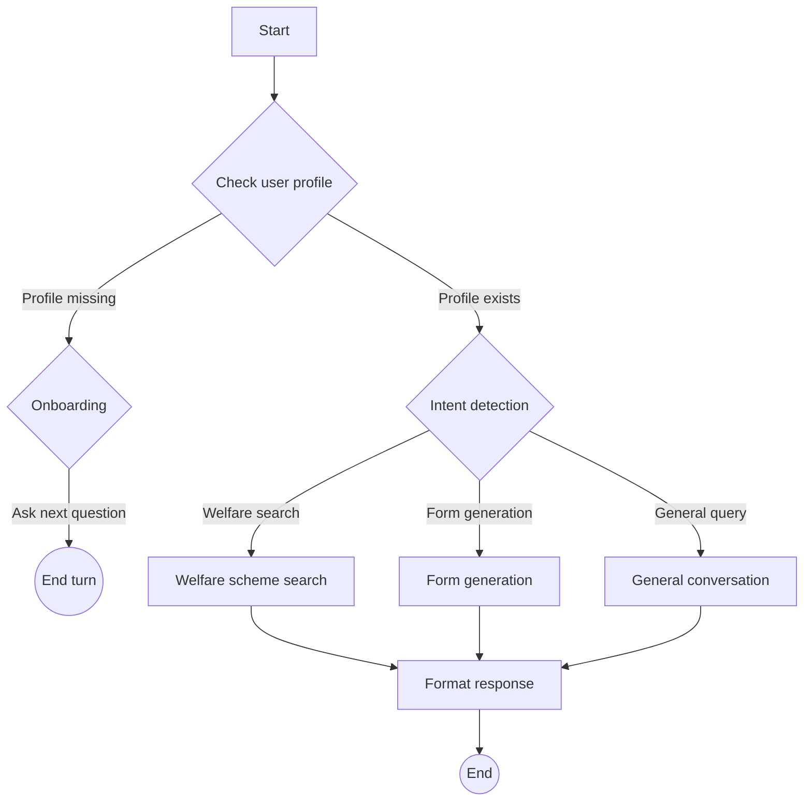

# Welfare Scheme Assistant 🏛️

A **next-generation, agentic FastAPI application** that acts as an intelligent assistant for Indian government welfare schemes. Designed for seamless interaction, personalized recommendations, and dynamic form generation, this application combines advanced AI workflows (LangGraph, LangChain), persistent storage, and a modern frontend—all in a single Python file.

---

## 🚩 Table of Contents

- [Features](#features)
- [Architecture & Workflow](#architecture--workflow)
- [Technology Stack](#technology-stack)
- [Detailed Code Structure](#detailed-code-structure)
- [API Endpoints](#api-endpoints)
- [Frontend Experience](#frontend-experience)
- [Setup & Installation](#setup--installation)
- [Usage Examples](#usage-examples)
- [Deployment Notes](#deployment-notes)
- [FAQ](#faq)
- [License](#license)
- [Contact](#contact)

---

## ✨ Features

### 🤖 Agentic AI Workflows
- **LangGraph-powered stateful agents:** Multi-turn, dynamic conversations.
- **Intent classification:** Routes messages based on user needs (`welfare_search`, `form_generation`, `general_query`).

### 📝 Conversational Onboarding
- **Dynamic profile building:** Automated, stepwise collection of user data via natural conversation.
- **Smart data extraction:** Uses LLMs to parse responses and auto-fill profile fields.

### 🔍 Welfare Scheme Discovery
- **Personalized search:** Combines user profile + live web research for relevant schemes.
- **Hybrid LLMs:** Fast intent detection (Groq), detailed content (Google Gemini).

### 📋 Automated Form Generation
- **End-to-end HTML forms:** Instantly generates styled, validated, and localized forms for scheme applications.
- **Web research integration:** Scrapes real requirements and eligibility from multiple sources for accuracy.
- **Language adaption:** Forms rendered in the user's local language (Hindi, Tamil, Bengali, etc.) based on state/profile.

### 📢 Notifications & Recommendations
- **Compelling, actionable scheme alerts:** Clickable, benefit-focused recommendations tailored to each user.
- **Urgency, relevance, and prioritization:** High-priority schemes highlighted with emotional triggers and calls to action.

### 💾 Persistent Data Storage
- **SQLite backend:** User profiles and chat histories are saved for continuity and analytics.
- **Easy reset & profile management:** API endpoints to view or delete data.

### 🖥️ Integrated Modern Frontend
- **Responsive chat UI:** HTML/CSS/JS frontend served directly from FastAPI.
- **Rich interactions:** Dynamic notifications, form previews, downloads, modals, and real-time updates.

### 🛠️ Robust, Extensible API
- **RESTful endpoints:** For chat, profiles, notifications, health, and serving generated forms.
- **WebSocket support:** Optional real-time bi-directional communication for advanced integrations.

---

## 🏗️ Architecture & Workflow

**High-level Workflow:**  
The application is orchestrated as a directed graph with conditional logic, enabling sophisticated AI-driven dialog and task execution.



**Key Components:**

- **LangGraph StateGraph:** Controls the flow, tracks states, and enables conditional branching.
- **Workflow Nodes:** Modular functions for each logical step (profile check, onboarding, intent detection, search, form creation, final response).
- **Global Services:** Centralized management for LLMs, web search, database, and workflow.

---

## 🧰 Technology Stack

| Layer         | Tech/Library                         | Purpose                                                   |
|---------------|-------------------------------------|-----------------------------------------------------------|
| Backend       | FastAPI, Uvicorn                    | Web server, API, frontend serving                         |
| AI/Agents     | LangChain, LangGraph                | Agentic workflows, prompt management                      |
| LLMs          | Groq, Google Gemini                 | Fast intent/IE (Groq), creative/generative (Gemini)       |
| Search        | Tavily Search API                   | Real-time welfare scheme web search                       |
| Storage       | SQLite                              | Persistent user and chat data                             |
| Frontend      | HTML, CSS, JavaScript               | Responsive, interactive chat & notifications UI           |

---

## 🗂️ Detailed Code Structure

### 1. Configuration & Initialization

- Loads `.env` for API keys (`GROQ_API_KEY`, `GOOGLE_API_KEY`, `TAVILY_API_KEY`).
- Validates all required environment variables.

### 2. FastAPI Setup

- Configures CORS for frontend connectivity.
- Sets up the main app and metadata.

### 3. Data Models

- **ChatMessage:** Incoming user chat.
- **ChatResponse:** AI response, onboarding, profile, form data.
- **UserProfile:** Stores user attributes for personalization.
- **NotificationResponse:** Personalized scheme notifications.

### 4. Agentic Workflow State

- **AgentState:** Tracks messages, profile, onboarding steps, intents, tool outputs, form metadata, timestamps, session ID.

### 5. Workflow Nodes

- **Profile Check:** Determines onboarding need.
- **Onboarding:** Conversationally collects and extracts profile data.
- **Intent Detection:** Classifies user intent using LLM.
- **Search:** Web-based, personalized scheme search.
- **Form Generation:** Multi-step process—analyzes request, performs targeted web searches, extracts requirements, generates HTML form with validation, saves locally.
- **General Query:** Handles fallback conversational requests.
- **Final Response:** Formats output for conversational delivery.

### 6. Workflow Construction

- Assembles nodes into a LangGraph StateGraph.
- Conditional edges enable dynamic routing based on state and intent.

### 7. SQLite Storage Layer

- User profiles (with all onboarding fields).
- Conversation history.
- Welfare schemes reference table (for future expansion).

### 8. Global Services

- Centralized singleton for LLMs, web tool, database, and compiled workflow.

### 9. API Endpoints

- `GET /` — Serves the full chat frontend.
- `POST /chat` — Main chat endpoint, invokes workflow.
- `GET/DELETE /user/{user_id}/profile` — Profile management.
- `GET /user/{user_id}/notifications` — Personalized scheme notifications.
- `GET /form/{form_filename}` — Download or preview generated forms.
- `GET /health` — Health check.
- `WEBSOCKET /ws/{user_id}` — Optional real-time chat.

### 10. Application Startup

- Runs via Uvicorn; prints service status and URLs.

---

## 🔌 API Endpoints

| Method | Endpoint                        | Description                                  |
|--------|---------------------------------|----------------------------------------------|
| GET    | `/`                             | Serves the full-featured chat frontend       |
| POST   | `/chat`                         | Main chat, workflows, onboarding, forms      |
| GET    | `/user/{user_id}/profile`       | Get user profile data                        |
| DELETE | `/user/{user_id}/profile`       | Delete user profile (reset/test)             |
| GET    | `/user/{user_id}/notifications` | Personalized scheme notifications            |
| GET    | `/form/{form_filename}`         | Serve/download generated HTML forms          |
| GET    | `/health`                       | Health check/status                          |
| WS     | `/ws/{user_id}`                 | Real-time chat via WebSocket (optional)      |

---

## 🖥️ Frontend Experience

- **Modern Chat UI:** Clean, mobile-friendly, and responsive.
- **Dynamic Notifications:** "My Schemes" modal with clickable, urgency-tagged recommendations.
- **Form Generation:** Preview and download customized application forms (multi-language, Bootstrap styled).
- **Real-time Feedback:** Typing indicators, instant responses, modals for enhanced interaction.

---

## 🚀 Setup & Installation

### Prerequisites

- Python 3.8+
- API keys for Groq, Google Gemini, Tavily

### Install Dependencies

```bash
python -m venv venv
source venv/bin/activate  # Windows: venv\Scripts\activate

pip install fastapi uvicorn "langchain[llms]" langgraph langchain_groq langchain_google_genai langchain-community python-dotenv tavily-python
```

### Configure Environment

Create a `.env` file:

```
GROQ_API_KEY="grok_..."
GOOGLE_API_KEY="AIza..."
TAVILY_API_KEY="tvly-..."
```

### Run the Application

```bash
python app.py
```

### Access the App

- **Chat Frontend:** [http://localhost:8000](http://localhost:8000)
- **API Documentation:** [http://localhost:8000/docs](http://localhost:8000/docs)

---

## 💡 Usage Examples

### 1. Get Welfare Scheme Recommendations

> "What schemes am I eligible for as a farmer from Tamil Nadu with a BPL income?"

Returns tailored suggestions, eligibility, and clickable notifications.

### 2. Generate Application Forms

> "I want to apply for Ayushman Bharat for my family in Delhi."

Produces a fully validated, localized HTML form ready for download or submission.

### 3. General Information

> "How do I get a disability certificate in Kerala?"

Gives concise, spoken-aloud friendly answers using real-time web research.

---

## 🏭 Deployment Notes

- For production: restrict CORS, secure API keys, consider using a production-ready database.
- Review privacy/data policies before deployment.
- Can be dockerized or deployed on cloud platforms supporting Python/FastAPI.

---

## ❓ FAQ

**Q: Is this app limited to Indian welfare schemes?**  
A: Yes, it's specialized for the Indian government context, but can be extended to other domains.

**Q: Can I customize the onboarding fields?**  
A: Easily—just modify the required fields and prompts in the workflow nodes.

**Q: What happens to user data?**  
A: All data is stored locally in SQLite and can be deleted via the API.

---

## 📝 License

This project is released for educational and demonstration purposes.  
See LICENSE file for details.

---

## 📬 Contact

For questions, feature requests, or bug reports, please open an issue or contact [adityachanna](https://github.com/adityachanna).

---
